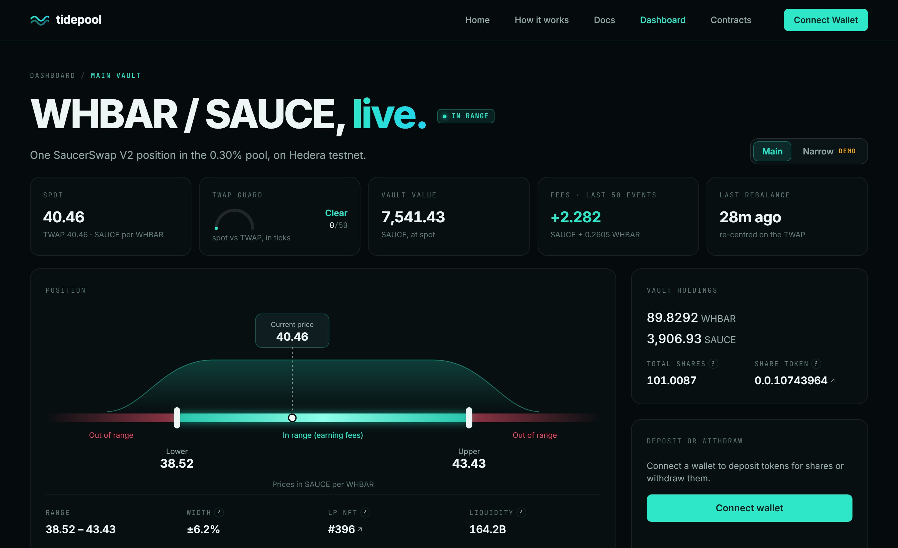
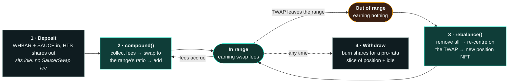
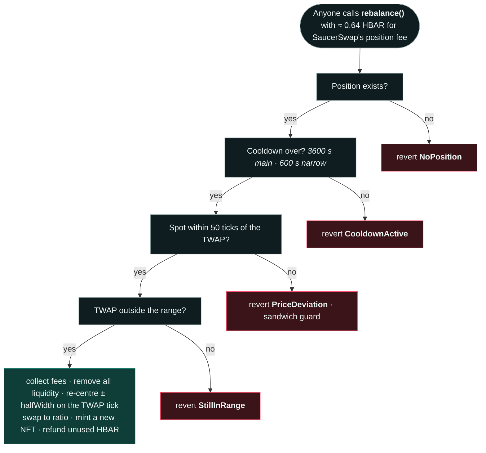
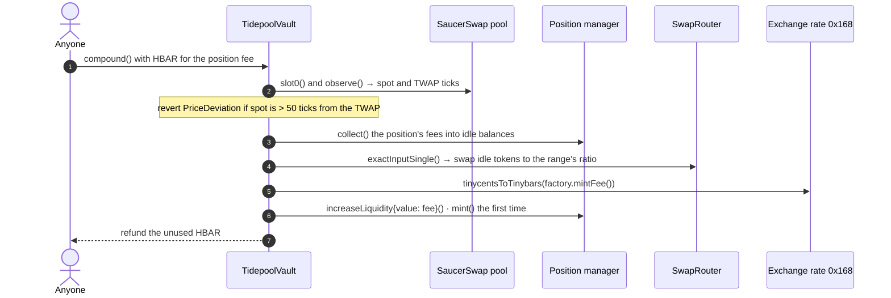
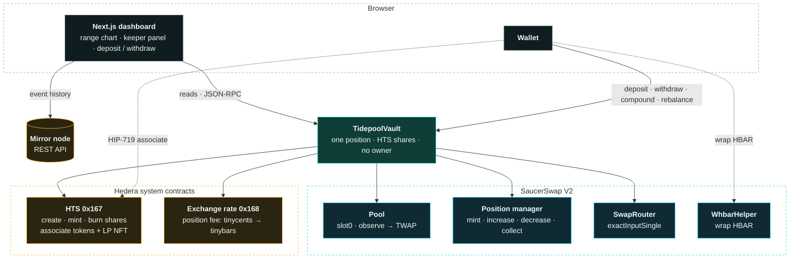
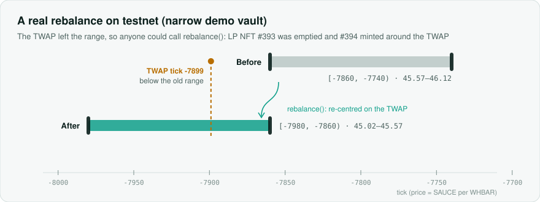
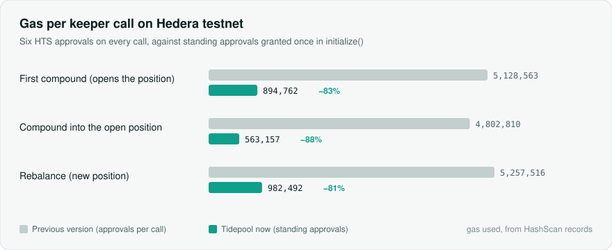

<div align="center">

# Tidepool

**A self-tending SaucerSwap V2 liquidity vault on Hedera, packaged as a Scaffold-HBAR template.**

[](https://github.com/aditi3175/tidepool-scaffold-hbar/actions/workflows/ci.yml)


[](LICENCE)



</div>

A vault that owns **one** SaucerSwap V2 concentrated-liquidity position. Depositors get a **native HTS share token**.
**Anyone** can compound the position's fees, and **anyone** can re-centre its range once the pool's TWAP has left it.
Hardhat contracts, a Next.js dashboard, and everything running on Hedera testnet.

**Live demo:** https://tidepool-scaffold.vercel.app

> [!WARNING]
> Testnet reference code. Not audited, not production-ready, no yield implied. Testnet pool prices are set by testnet
> traders and do not track real markets.

| | |
|---|---|
| **No owner** | No admin key, pause, fee switch or upgrade path. The deployer can call `initialize()` once. |
| **Permissionless keepers** | `compound()` and `rebalance()` are open to anyone; the caller pays SaucerSwap's HBAR position fee and the vault refunds the rest. |
| **Sandwich-guarded** | Deposit, compound and rebalance refuse to run while spot is more than 50 ticks from the 600-second TWAP. Withdrawals always work. |
| **Proven on testnet** | Deposit, compound, withdraw and a real rebalance, each linked on HashScan ([evidence](#testnet-evidence)). |

## Quick start

Prerequisites: Node.js 20.18.3 or later, and Git with `user.name` and `user.email` set.

```bash
npm create scaffold-hbar@latest -- --template aditi3175/tidepool-scaffold-hbar
cd <your-project>
npm run next:dev
```

> [!NOTE]
> Keep the `--` before `--template`. npm 7+ swallows `--template` without it and the CLI falls back to its
> built-in templates. Alternative: `npx create-scaffold-hbar@latest --template aditi3175/tidepool-scaffold-hbar`.

The CLI asks for the Hedera network (choose testnet) and whether to install Hedera Skills (optional). Then open
http://localhost:3000/dashboard and connect a wallet on Hedera Testnet (chain 296).

| Route | What's there |
|---|---|
| `/dashboard` | The live reference vaults: range chart, deposit and withdraw, keeper panel, activity |
| `/how-it-works` | The four moves, each with a figure |
| `/docs` | Quickstart, using the vault, keepers, adapting it, Hedera gotchas, troubleshooting |
| `/debug` | Every contract function, straight from the ABI |

What a fresh scaffold gives you:

| Out of the box | Why |
|---|---|
| A dashboard wired to the reference vaults | `packages/nextjs/contracts/deployedContracts.ts` is committed, so you can deposit, withdraw and compound against the main and narrow demo vaults straight away. |
| 27 unit tests that run offline | `npm run hardhat:test` mocks SaucerSwap, HTS (`0x167`) and the exchange-rate system contract (`0x168`). No network or keys. |
| Operator scripts for your own vault | `hardhat-deploy` records are gitignored, so `hardhat:smoke`, `hardhat:compound` and friends work after you [deploy your own vault](#deploy-your-own-vault). |

There is no local-chain flow: the vault calls live SaucerSwap V2 contracts, so it only makes sense on testnet (or
mainnet). Commands use npm, the template's default; with Yarn drop the `run`, and with npm pass extra flags after `--`.

## How it works



1. **Deposit** both pool tokens in the vault's current ratio and receive HTS shares. Deposits sit idle until the next
   compound, so depositing costs no SaucerSwap fee.
2. **Compound** collects fees, swaps idle balances to the range's token ratio, and adds everything to the position. The
   first call mints the position, centred on the TWAP tick.
3. **Rebalance** only succeeds once the TWAP has left the range. It removes all liquidity, re-centres a fixed-width range
   on the TWAP, and mints a new position NFT.
4. **Withdraw** returns your share of the position and idle balances and burns your shares. It skips the TWAP check, so
   you can always exit.

### Why a keeper can't hurt the vault

`compound()` and `rebalance()` are permissionless, so the contract checks every condition itself, in this order.
Someone can push spot around inside one transaction, but not the 600-second TWAP, so a sandwich attempt makes the call
revert instead of forcing a bad range.



`compound()` runs the same price guard, refuses a position whose range no longer holds the TWAP (`OutOfRange`: that is
rebalance's job), and reverts with `NothingToCompound` when there is nothing to add. The dashboard's keeper panel shows
each of these checks live, so you see why an action is unavailable before paying for it.

### One compound, call by call



## Architecture



### Every Hedera and SaucerSwap service in play

| Service | What Tidepool does with it | Where |
|---|---|---|
| **HTS system contract** `0x167` | The vault creates its own 8-decimal share token, mints and burns it, and associates itself with WHBAR, SAUCE and the LP NFT collection | `TidepoolVault.sol` |
| **HTS token info** | Reads each token's supply type to cap standing allowances at a finite token's max supply | `TidepoolVault.sol` |
| **HIP-719 association** | Wallets associate the share token by calling `associate()` on the token address | `useHtsAccount.ts` |
| **Exchange-rate system contract** `0x168` | Converts SaucerSwap's position fee from tinycents to tinybars on chain | `TidepoolVault.sol` |
| **Mirror node REST** | Activity feed, and plain-language revert reasons for failed transactions | `useVaultActivity.ts`, `useTxFeedback.ts` |
| **SaucerSwap V2 pool** | `slot0` for spot, `observe` for the 600-second TWAP | `TidepoolVault.sol`, `RangeMath.sol` |
| **SaucerSwap position manager** | Owns the position NFT: `mint`, `increaseLiquidity`, `decreaseLiquidity`, `collect` | `TidepoolVault.sol` |
| **SaucerSwap SwapRouter** | Swaps idle balances to the range's ratio before adding liquidity | `TidepoolVault.sol` |
| **SaucerSwap WhbarHelper** | Wraps HBAR to WHBAR from the deposit panel (never the WHBAR contract directly) | `DepositCard.tsx` |
| **Sourcify v2** | Verified source on HashScan (`npm run hardhat:verify:sourcify`) | `scripts/` |

Full design, maths, invariants and threat model: [`docs/ARCHITECTURE.md`](docs/ARCHITECTURE.md).

<details>
<summary><b>Project map</b></summary>

```
packages/hardhat/
  contracts/tidepool/TidepoolVault.sol       the vault
  contracts/tidepool/libraries/RangeMath.sol TWAP, range placement, swap-to-ratio (MIT v4-core maths only)
  contracts/tidepool/interfaces/             the SaucerSwap V2 surface the vault calls
  contracts/tidepool/test/Mocks.sol          test doubles, never deployed
  tidepool.config.ts                         pool, router, manager and vault parameters per network
  deploy/                                    main vault and optional narrow demo vault
  scripts/                                   smoke, compound, withdraw, rebalance, move-price, verify
  test/TidepoolVault.test.ts                 unit tests
packages/nextjs/
  app/page.tsx                               landing page
  app/dashboard/page.tsx                     dashboard
  app/how-it-works/, app/docs/, app/debug/   How it works, docs, contract debugger
  app/_components/tidepool/                  dashboard components (cards, range chart, keeper panel)
  components/pulse/                          shared UI: tiles, labels, the TWAP dial
  content/docs/                              docs pages, in Markdown
  hooks/tidepool/                            vault reads, HTS association, keeper preconditions, activity
  utils/tidepool/                            constants, errors, maths, vault list
```

</details>

## Testnet evidence

<picture>
  <source media="(prefers-color-scheme: dark)" srcset="docs/images/rebalance-dark.svg">
  
</picture>

The rebalance above is [`0xf55864c1…0654`](https://hashscan.io/testnet/transaction/0xf55864c1fc7bdd54ae9597ecae2f8f70e534c0af4c0c7fb14da31065ceda0654)
(982,492 gas). Every step of the reference vaults' lifecycle is on HashScan:

| Step | Transaction | Result |
|---|---|---|
| Main: first compound (mints NFT #392) | [`0x236d6545…1741`](https://hashscan.io/testnet/transaction/0x236d65455eec356fe3d726b04a4c91b829341433ddeb07946e089787292a1741) | TWAP tick −7702 → range [−8340, −7140) |
| Main: compound with collected fees | [`0x76c31145…a9ca`](https://hashscan.io/testnet/transaction/0x76c3114520d0693e07ae4f3b53128d89d9a0ef672e9aec153b8291fbc7e1a9ca) | `FeesCollected` 0.00466241 WHBAR + 0.213024 SAUCE, added to #392 |
| Main: deposit from the dashboard | [`0xbcfc48e9…d82f`](https://hashscan.io/testnet/transaction/0xbcfc48e9cee0edcb1610f430ce150e85152c9677f5a77811375cbc4bf18fd82f) | 0.99988942 WHBAR + 38.245393 SAUCE in; 1.00966568 shares out |
| Main: withdraw from the dashboard | [`0xb8132ee0…f7b4`](https://hashscan.io/testnet/transaction/0xb8132ee09d555da31bab3a66daf33e305269eda8b808a6e2b2de8b78cee6f7b4) | 0.001 shares burned; 0.0009903 WHBAR + 0.037879 SAUCE out |
| Narrow: rebalance (#393 → #394) | [`0xf55864c1…0654`](https://hashscan.io/testnet/transaction/0xf55864c1fc7bdd54ae9597ecae2f8f70e534c0af4c0c7fb14da31065ceda0654) | TWAP tick −7899: [−7860, −7740) → [−7980, −7860) |
| Main: rebalance, sent from the dashboard (#392 → #396) | [`0xbf698e4c…ccb6`](https://hashscan.io/testnet/transaction/0xbf698e4c105e67d5cdefcb7adc76da48629501f8813dc4bc24898f69af37ccb6) | TWAP tick −8920: [−8340, −7140) → [−9540, −8340) |
| Narrow: rebalance, sent from the dashboard (#394 → #397) | [`0xceeb9dcb…13d0`](https://hashscan.io/testnet/transaction/0xceeb9dcbbe430a5af77754b6b19de6ee5c8260f33be42fa45c3ce03e883113d0) | TWAP tick −9046: [−7980, −7860) → [−9120, −9000) |

<details>
<summary><b>Full evidence log: contracts, every transaction, gas and fees</b></summary>

| Item | Reference |
|---|---|
| Main vault | [`0x3BfC02f414956E66fB3B722fC935500B946ac181`](https://hashscan.io/testnet/contract/0x3BfC02f414956E66fB3B722fC935500B946ac181) (0.0.10743961) · share token 0.0.10743964 · LP NFT 0.0.1310436 #396 (#392 emptied by the rebalance) · source verified on Sourcify (exact match) |
| Narrow demo vault | [`0x7bBfa539173e44aA41aFe7aB9D9Dd52edd42D244`](https://hashscan.io/testnet/contract/0x7bBfa539173e44aA41aFe7aB9D9Dd52edd42D244) (0.0.10744069) · share token 0.0.10744072 · LP NFT 0.0.1310436 #397 (#393 and #394 emptied by the rebalances) · source verified on Sourcify (exact match) |
| Pool, WHBAR/SAUCE 0.30% | [`0x37814eDc1ae88cf27c0C346648721FB04e7E0AE7`](https://hashscan.io/testnet/contract/0x37814eDc1ae88cf27c0C346648721FB04e7E0AE7) (0.0.2661057) |

| Step | Transaction | Result |
|---|---|---|
| Main: initialize (associations, share token, standing approvals) | [`0x9c08525d…ead0`](https://hashscan.io/testnet/transaction/0x9c08525dfeaf083807dcffe31a8c44699ccfc7a8d8322af92eaab1efe7acead0) | 5,236,012 gas; fee charged 20.98 HBAR, of which 15.27 HBAR is the HTS token-creation fee (14.73 of the 30 HBAR sent was refunded) |
| Main: deposit | [`0xd799426f…7eb1`](https://hashscan.io/testnet/transaction/0xd799426f2162a34100648cfb0c2a317caac457258a4b80902ba6994fe4227eb1) | 161.42039494 WHBAR + 922.334593 SAUCE in; 99.999 shares out (0.001 kept by the vault as dead shares) |
| Main: first compound (mints position NFT #392) | [`0x236d6545…1741`](https://hashscan.io/testnet/transaction/0x236d65455eec356fe3d726b04a4c91b829341433ddeb07946e089787292a1741) | TWAP tick −7702 → range [−8340, −7140); 894,762 gas; 0.98 HBAR fee + 0.64 HBAR position fee |
| Swaps to generate fees (3) | [`0x823cf988…6dae`](https://hashscan.io/testnet/transaction/0x823cf98821ce66a7befecad7ae13a9ab33c5662fa87ef2273bf2a8320b9e6dae), [`0x530100cd…31b1`](https://hashscan.io/testnet/transaction/0x530100cd7e77c59234adee575e8714e4af1a1777aba214839606e966cffc31b1), [`0xc9436787…40c9`](https://hashscan.io/testnet/transaction/0xc9436787d51aef1b7c4f4e28fc97019ee81f4876e4fad47bd6ce053a97e340c9) | 228.45 SAUCE → 4.97 WHBAR each, inside the range |
| Main: compound with collected fees | [`0x76c31145…a9ca`](https://hashscan.io/testnet/transaction/0x76c3114520d0693e07ae4f3b53128d89d9a0ef672e9aec153b8291fbc7e1a9ca) | `FeesCollected` 0.00466241 WHBAR + 0.213024 SAUCE; +24,510,816,970 liquidity on #392; 563,157 gas; 0.61 HBAR fee + 0.64 HBAR position fee |
| Main: deposit, sent from the dashboard by a second account | [`0xbcfc48e9…d82f`](https://hashscan.io/testnet/transaction/0xbcfc48e9cee0edcb1610f430ce150e85152c9677f5a77811375cbc4bf18fd82f) | 0.99988942 WHBAR + 38.245393 SAUCE in; 1.00966568 shares out |
| Main: withdraw, sent from the dashboard by a second account | [`0xb8132ee0…f7b4`](https://hashscan.io/testnet/transaction/0xb8132ee09d555da31bab3a66daf33e305269eda8b808a6e2b2de8b78cee6f7b4) | 0.001 shares burned; 0.0009903 WHBAR + 0.037879 SAUCE out |
| Narrow: first compound (mints NFT #393) | [`0x1063c0d5…61d3`](https://hashscan.io/testnet/transaction/0x1063c0d56c7fc4463a0e09228d9f81d9035144162b83780817b9ff272bef61d3) | TWAP tick −7793 → range [−7860, −7740); 942,891 gas |
| Price move down | [`0xd3afb662…c658`](https://hashscan.io/testnet/transaction/0xd3afb662d0c7d96af20fa625d337f715cfb2d61b7116960fa70feff31017c658) | 120 WHBAR → 5,459.99313 SAUCE; spot tick −7793 → −7899 |
| Narrow: rebalance (#393 → #394) | [`0xf55864c1…0654`](https://hashscan.io/testnet/transaction/0xf55864c1fc7bdd54ae9597ecae2f8f70e534c0af4c0c7fb14da31065ceda0654) | TWAP tick −7899: [−7860, −7740) → [−7980, −7860); #393 liquidity now 0; 982,492 gas; 1.07 HBAR fee + 0.64 HBAR position fee |
| Price restored | [`0xac066a24…5a06`](https://hashscan.io/testnet/transaction/0xac066a24749c6d70f9f278d2de2cf80a3c31d38cbf530f22aa551ef1a9d35a06) | 5,459 SAUCE → 119.29406227 WHBAR; spot tick −7902 → −7794 |
| Main: rebalance, sent from the dashboard (#392 → #396) | [`0xbf698e4c…ccb6`](https://hashscan.io/testnet/transaction/0xbf698e4c105e67d5cdefcb7adc76da48629501f8813dc4bc24898f69af37ccb6) | TWAP tick −8920: [−8340, −7140) → [−9540, −8340); `FeesCollected` 0.21283843 WHBAR + 0.007141 SAUCE; #392 liquidity now 0; 1,043,853 gas; 0.85 HBAR fee + 0.48 HBAR position fee |
| Narrow: rebalance, sent from the dashboard (#394 → #397) | [`0xceeb9dcb…13d0`](https://hashscan.io/testnet/transaction/0xceeb9dcbbe430a5af77754b6b19de6ee5c8260f33be42fa45c3ce03e883113d0) | TWAP tick −9046: [−7980, −7860) → [−9120, −9000); #394 liquidity now 0; 1,000,182 gas; 0.81 HBAR fee + 0.48 HBAR position fee |

Fees are the network fee charged for each transaction; the SaucerSwap position fee is paid on top by every compound and
rebalance, from the HBAR sent with the call. It is 5 US cents converted at the current exchange rate: 0.64079562 HBAR
in September, 0.47746676 HBAR on 1 October (the amount the vault forwarded to the position manager, from the mirror
node's contract actions). The full log, including the two failed `initialize`
attempts (association gas, then an allowance above SAUCE's max supply), is in `docs/ARCHITECTURE.md` §13.

</details>

### What standing approvals saved

<picture>
  <source media="(prefers-color-scheme: dark)" srcset="docs/images/gas-dark.svg">
  
</picture>

Each HTS allowance approval made by a contract costs about 705k gas. The first version approved the position manager
and router on every call; Tidepool grants capped standing allowances once in `initialize()` instead, and the
permissionless `refreshApprovals()` restores them when they run low.

**When does compounding pay?** Each compound costs SaucerSwap's position fee (5 US cents in HBAR, ≈ 0.64 HBAR at the
testnet rate) plus gas: about 1.25 HBAR in total into an existing position. Compound when the fees you'd collect are
worth more than that; a keeper should check `positions()` fees before calling.

## Deploy your own vault

```bash
npm run hardhat:account:generate   # or hardhat:account:import with an existing ECDSA key
npm run hardhat:account            # shows the address to fund
```

Fund the account with about 100 testnet HBAR from https://portal.hedera.com/faucet, then:

```bash
npm run hardhat:deploy:testnet     # deploy + initialize
npm run hardhat:smoke              # wrap HBAR, buy SAUCE, deposit, open the first position; prints HashScan links
npm run hardhat:verify:sourcify    # verify on Sourcify so HashScan shows the source
```

`initialize()` sends 30 HBAR. About 15.3 HBAR pays the HTS token-creation fee and the rest is refunded. Deploying
regenerates `deployedContracts.ts`, so the dashboard switches to your vault.

```bash
npm run hardhat:compound                     # compound fees into the position
WITHDRAW_BPS=1000 npm run hardhat:withdraw   # withdraw 10% of your shares
npm run hardhat:simulate-traders             # swap back and forth so the position earns fees
```

<details>
<summary><b>Optional: the narrow-vault rebalance demo</b></summary>

A rebalance needs the TWAP to leave the range, which would take hundreds of HBAR of swaps on the main vault's
±600-tick range. So the template includes a separate demo vault with ±60 ticks and a 600-second cooldown. The main
vault is never touched.

> [!CAUTION]
> This moves the price of the *shared* SaucerSwap WHBAR/SAUCE testnet pool for everyone, including the main vault's
> position. Keep the move small and swap back afterwards.

```bash
npm run hardhat:deploy:narrow
TIDEPOOL_VAULT=TidepoolVaultNarrow DEPOSIT0=2 DEPOSIT1=93 npm run hardhat:deposit
TIDEPOOL_VAULT=TidepoolVaultNarrow npm run hardhat:compound
TIDEPOOL_VAULT=TidepoolVaultNarrow DIRECTION=down AMOUNT=120 WRAP_HBAR_IF_NEEDED=true npm run hardhat:move-price
# wait ~7–10 minutes until the TWAP has left the range and is within 50 ticks of spot
TIDEPOOL_VAULT=TidepoolVaultNarrow npm run hardhat:rebalance
TIDEPOOL_VAULT=TidepoolVaultNarrow DIRECTION=up AMOUNT=<SAUCE received> npm run hardhat:move-price
```

In PowerShell, set each variable first with `$env:NAME="value"`, then run the command.

The scripts are defensive. `move-price` quotes the resulting tick and asks for confirmation before swapping, and only
wraps HBAR with `WRAP_HBAR_IF_NEEDED=true` plus a second confirmation. `rebalance` has no default vault, refuses the
main vault unless `ALLOW_MAIN_VAULT_REBALANCE=true`, runs every precondition read-only before sending, and verifies the
new NFT and range afterwards. `AMOUNT=120` matched the pool at the time of our test, so re-quote before using it.

</details>

## Environment variables

| Variable | Where | Purpose |
|---|---|---|
| `DEPLOYER_PRIVATE_KEY_ENCRYPTED` | `packages/hardhat/.env` | Written by `hardhat:account:generate` / `import`. Encrypted, decrypted with your password at run time. Never commit `.env`. |
| `HEDERA_RPC_URL` | Hardhat | Optional RPC override. Default `https://testnet.hashio.io/api`. |
| `NEXT_PUBLIC_WALLET_CONNECT_PROJECT_ID`, `NEXT_PUBLIC_HEDERA_TESTNET_RPC_URL`, `NEXT_PUBLIC_MIRROR_NODE_URL` | frontend | Optional overrides. |

<details>
<summary><b>Script options</b></summary>

| Variable | Script | Purpose |
|---|---|---|
| `TIDEPOOL_VAULT` | deposit, compound, withdraw, move-price, rebalance | Deployment to target. Defaults to `TidepoolVault`, except deposit and rebalance, which require it. |
| `DEPOSIT0`, `DEPOSIT1` | deposit | Exact token amounts. |
| `WITHDRAW_BPS` | withdraw | Share of your balance in basis points. Default 1000. |
| `DIRECTION`, `AMOUNT`, `WRAP_HBAR_IF_NEEDED` | move-price | `down` sells token0, `up` sells token1. |
| `ALLOW_MAIN_VAULT_REBALANCE` | rebalance | Must be `true` to target the main vault. |
| `WRAP_HBAR`, `BUY_HBAR` | smoke | HBAR to wrap and to spend on SAUCE. Default 20 each. |
| `ROUNDS`, `AMOUNT_HBAR` | simulate-traders | Round trips and HBAR per trip. Default 3 and 5. |

</details>

## Adapt it

Every vault parameter is a constructor argument in `packages/hardhat/tidepool.config.ts`. They're immutable, so
changing one means deploying a new vault.

| Parameter | Main vault | Narrow demo | Rules |
|---|---|---|---|
| `pool` | WHBAR/SAUCE 0.30% | same pool | Must be a SaucerSwap V2 pool. The constructor checks it against the factory. |
| `halfWidth` | 600 ticks (≈ ±6.2%) | 60 ticks (≈ ±0.6%) | Positive multiple of the pool's tick spacing: fee 500 → 10, 1500 → 30, 3000 → 60, 10000 → 200. |
| `twapWindow` | 600 s | 600 s | The pool needs at least this much observation history. |
| `maxTwapDeviation` | 50 ticks (≈ 0.5%) | 50 ticks | Tighter is safer but refuses more often in volatile pools. |
| `rebalanceCooldown` | 3600 s | 600 s | Minimum gap between rebalances. |
| `swapSlippageBps` | 100 (1%) | 100 (1%) | Extra slippage on the swap-to-ratio step, on top of the pool fee. Applies to compound and rebalance. |

To point Tidepool at a different pool:

1. **Check the pool's oracle.** Call `slot0()` on the pool and look at `observationCardinality`. If it's 1, `observe()`
   reverts after any swap and the vault will refuse to act. Anyone can fix that by calling
   `increaseObservationCardinalityNext(n)` on the pool, then waiting for history to build up past `twapWindow`.
2. **Set** `pool` and a valid `halfWidth` in `tidepool.config.ts`.
3. **Deploy** with `npm run hardhat:deploy:testnet`.

For mainnet, add a `hederaMainnet` entry. SaucerSwap mainnet addresses are listed in `docs/ARCHITECTURE.md` §2.4 but
haven't been tested with this template.

Natural extensions: a keeper (a cron job that calls `compound()` only when collected fees exceed the cost, and
`rebalance()` when `getPriceState()` reports out of range), other range strategies, burning emptied position NFTs, or
single-sided deposits.

## Hedera gotchas

Things that work differently from Ethereum and cost time to discover. Each has a longer write-up with a reproduction in
`docs/ARCHITECTURE.md` §6.

| On Hedera | What Tidepool does |
|---|---|
| **HTS amounts are `int64`.** An 18-decimal share token would cap supply at about 9.2 tokens. | 8-decimal shares; approvals never use `uint256` max. |
| **Contracts must associate before receiving tokens.** | The vault associates with both pool tokens and the LP NFT collection in `initialize()`; the dashboard offers HIP-719 `associate()` for the share token. |
| **Association and approval from a contract cost ~650–780k gas each.** | `initialize()` does them once (5,236,012 gas on testnet); an early version failed at a 2M limit with `HtsCallFailed(21)`. |
| **HTS rejects an allowance above a finite token's max supply** (`AMOUNT_EXCEEDS_TOKEN_MAX_SUPPLY`). | Reads each token's supply type and caps allowances at `maxSupply` (SAUCE) or `type(int64).max` (WHBAR). |
| **HBAR has two unit systems.** JSON-RPC `value` is weibar (18 decimals); contracts see tinybar (8). | The frontend multiplies tinybars by 1e10. |
| **SaucerSwap charges a position fee in HBAR,** quoted in tinycents, on every `mint` and `increaseLiquidity`. | Converts it with `0x168` and forwards exactly `tinycentsToTinybars(fee) + 1`; more lets the manager wrap the caller's HBAR instead of pulling the vault's WHBAR. |
| **Don't call or approve the WHBAR contract.** | Wraps through SaucerSwap's WhbarHelper; approving the WHBAR *token* is fine. |
| **Position mints can't be simulated:** `eth_call` returns `INVALID_NFT_ID` for mints that succeed on chain. | `compound()` and `rebalance()` go out with a fixed 8M gas limit after read-only precondition checks. Don't re-enable simulation. |
| **`quoteMintFee()` isn't `view`,** because the exchange-rate interface is declared non-view. | Call it with `eth_call` / `simulateContract`. |
| **Fresh scaffolds need two build fixes.** | A root `.npmrc` with `legacy-peer-deps=true`, and a webpack alias stubbing the optional `@x402/*` peers pulled in by wagmi. |
| **Sourcify v1 routes return 404.** | `npm run hardhat:verify:sourcify` uses the v2 API. |

<details>
<summary><b>Known limitations</b></summary>

- Not audited. Testnet only; mainnet addresses in the docs are untested.
- One pool per vault and one strategy: a fixed-width range around the TWAP tick.
- No keeper is included. `compound()` and `rebalance()` run only when someone calls them.
- Each compound or rebalance costs the SaucerSwap position fee (≈ 0.64 HBAR on testnet) plus gas: on testnet 0.61 HBAR
  for a compound into an existing position (563,157 gas) and 1.07 HBAR for a rebalance (982,492 gas). Compounding small
  fees loses money.
- The vault gives the SaucerSwap position manager and swap router standing allowances (set once in `initialize()`) to
  avoid about 700k gas per approval on every call. Both addresses are immutable and checked against the SaucerSwap
  factory in the constructor.
- `compound()` refuses to add to a position whose range no longer contains the TWAP (`OutOfRange`). Call `rebalance()`
  instead.
- Standing allowances are capped per token: a token's `maxSupply` if it has a finite supply (HTS rejects larger
  allowances with `AMOUNT_EXCEEDS_TOKEN_MAX_SUPPLY`), otherwise `type(int64).max`. They shrink as the manager and router
  spend them and are not topped up automatically; once one runs low, compound and rebalance revert until someone calls
  the permissionless `refreshApprovals()`.
- The swap-to-ratio step ignores its own price impact, so some tokens can stay idle until the next compound.
- `getTotalAmounts()` excludes fees that haven't been collected yet. Every deposit, withdraw, compound and rebalance
  collects first, so this only affects the view.
- Emptied position NFTs stay in the vault after a rebalance. Burning them would need an NFT approval to the manager.
- Pools with an observation cardinality of 1 can't be used until it's increased (see [Adapt it](#adapt-it)).
- A contract that calls `compound()` or `rebalance()` must be able to receive HBAR, or the refund reverts with
  `RefundFailed`.

</details>

<details>
<summary><b>Troubleshooting</b></summary>

| Symptom | Cause and fix |
|---|---|
| `initialize` reverts with `HtsCallFailed(21)` | Out of gas during token association. The child record on the mirror node shows `INSUFFICIENT_GAS`. Use at least 5M gas; the deploy script already does. |
| `TwapUnavailable` | The pool's oracle can't answer for `twapWindow`. See step 1 of [Adapt it](#adapt-it). |
| `PriceDeviation` | Spot is too far from the TWAP, usually right after a large swap. Wait for the TWAP to catch up. |
| `CooldownActive` / `StillInRange` | Rebalance preconditions aren't met yet. The keeper panel shows which one. |
| Deposit or withdraw fails with a token error | Your account isn't associated with WHBAR, SAUCE, or the share token. Use the Associate buttons. |
| `hardhat:deploy --network hederaTestnet` deploys to the wrong network | npm swallowed the flag. Use `npm run hardhat:deploy:testnet` or `npm run hardhat:deploy -- --network hederaTestnet`. |
| `yarn` is not recognized | Run `corepack enable`, or call the bundled copy: `node .yarn/releases/yarn-3.2.3.cjs <script>`. |
| "Invalid Chai property" when running tests on Windows | The terminal path's casing doesn't match the real folder, so chai loads twice. `cd` into the folder with the exact casing. |
| `ChunkLoadError` in the dev server | `next build` and `next dev` share `.next/`. Stop the dev server and delete `packages/nextjs/.next` before building. |

</details>

## Licence

MIT, see [`LICENCE`](LICENCE). Depends on `@uniswap/v4-core` (MIT libraries only), `@hiero-ledger/hiero-contracts`
(Apache-2.0) and OpenZeppelin (MIT). No GPL or BUSL code is copied. AI-assisted use is covered in
[`AGENTS.md`](AGENTS.md).
